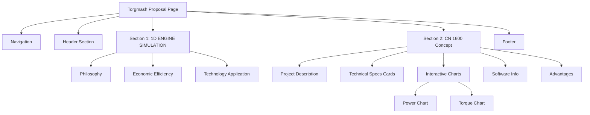
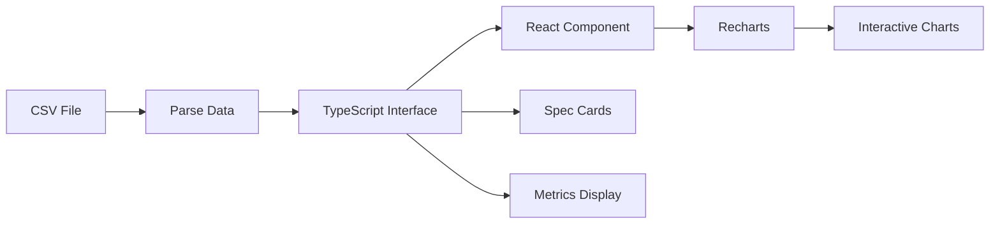
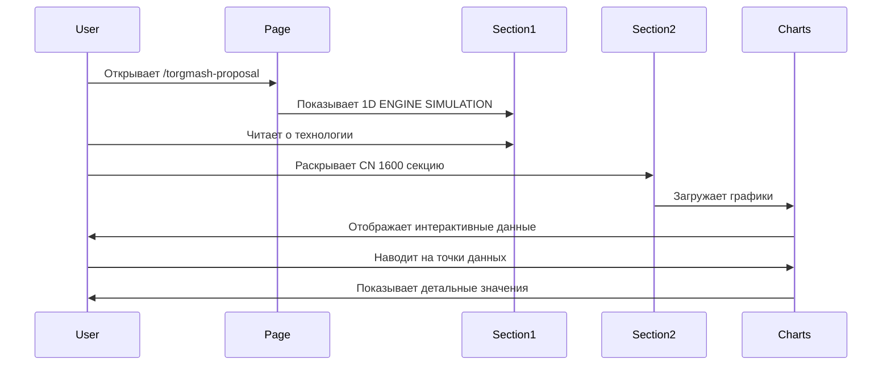

# План реализации страницы CN 1600

## 📋 Обзор проекта

**Цель**: Создать презентационную страницу для демонстрации возможностей команды Торгмаш Инжиниринг в проектировании концепт-двигателя CN 1600 Ver_1.1 для спортивных прототипов ArtLine.

**URL**: `/torgmash-proposal` (замена существующей страницы)

**Статус**: В планировании

---

## 🎯 Ключевые требования

### Функциональные требования
1. **Сохранить существующую секцию** "1D ENGINE SIMULATION - Современное моделирование ДВС"
2. **Добавить новую секцию** с реальными расчетами двигателя CN 1600 Ver_1.1
3. **Интерактивные графики** мощности и крутящего момента
4. **Презентационный стиль** с техническими данными (гибридный подход)
5. **Адаптивный дизайн** для всех устройств

### Технические требования
- Next.js 15.3.4 + React 19
- TypeScript
- Recharts для визуализации данных
- Tailwind CSS для стилизации
- Lucide React для иконок

---

## 📊 Анализ данных CN 1600 Ver_1.1

### Исходные данные из CSV
```
Диапазон оборотов: 3400 - 8400 об/мин
Количество точек: 25 измерений
Параметры: RPM, P-Av (PS), Torque (N·m)
```

### Ключевые метрики

#### Мощность (P-Av)
- **Минимум**: 71.82 PS @ 3400 об/мин
- **Максимум**: 211.37 PS @ 8000 об/мин
- **Пиковая мощность**: 211.37 PS @ 8000 об/мин
- **Рабочий диапазон**: 3400-8400 об/мин

#### Крутящий момент (Torque)
- **Минимум**: 134.30 N·m @ 3800 об/мин
- **Максимум**: 199.60 N·m @ 6200 об/мин
- **Пиковый момент**: 199.60 N·m @ 6200 об/мин
- **Плато момента**: 185-200 N·m в диапазоне 5000-7000 об/мин

#### Характеристики двигателя
- **Объем**: 1600 cc
- **Тип**: Концепт спортивного двигателя
- **Назначение**: Спортивные прототипы ArtLine
- **Особенность**: Широкое плато крутящего момента

---

## 🏗️ Архитектура страницы

### Структура компонентов

```
TorgmashProposal (page.tsx)
├── Navigation
├── Header Section
│   ├── Логотип/Иконка
│   ├── Заголовок "Торгмаш Инжиниринг"
│   └── Описание компании
│
├── Section 1: 1D ENGINE SIMULATION (существующая)
│   ├── Философия виртуального проектирования
│   ├── Экономическая эффективность
│   └── Применение технологии
│
├── Section 2: CN 1600 - Концепт двигателя будущего (НОВАЯ)
│   ├── Описание проекта
│   │   ├── Контекст: ArtLine + спортпрототипы
│   │   ├── Задача: проектирование и расчет
│   │   └── Решение: CN 1600 Ver_1.1
│   │
│   ├── Технические характеристики
│   │   ├── Карточка: Объем (1600 cc)
│   │   ├── Карточка: Пиковая мощность (211.37 PS @ 8000 rpm)
│   │   ├── Карточка: Пиковый момент (199.60 N·m @ 6200 rpm)
│   │   └── Карточка: Рабочий диапазон (3400-8400 rpm)
│   │
│   ├── Интерактивные графики
│   │   ├── График мощности (RPM vs Power)
│   │   ├── График крутящего момента (RPM vs Torque)
│   │   └── Комбинированный график (опционально)
│   │
│   ├── Программное обеспечение
│   │   ├── 1D ENGINE SIMULATION
│   │   ├── Методология расчета
│   │   └── Точность моделирования
│   │
│   └── Преимущества для спортпрототипов
│       ├── Широкое плато момента
│       ├── Высокая удельная мощность
│       └── Оптимизация под гоночные условия
│
└── Footer
    ├── Контактная информация
    └── Призыв к действию
```

---

## 🎨 Дизайн-концепция

### Цветовая схема
- **Основной**: Синий (#2563eb) - технологичность, надежность
- **Акцент**: Зеленый (#10b981) - инновации, будущее
- **Дополнительный**: Фиолетовый (#8b5cf6) - премиальность
- **Нейтральный**: Серый (#6b7280) - текст, фон

### Типографика
- **Заголовки**: font-bold, text-2xl/3xl/4xl
- **Подзаголовки**: font-semibold, text-xl
- **Текст**: text-gray-700, text-base/sm
- **Акценты**: font-medium, цветной текст

### UI элементы
- **Карточки**: border, rounded-lg, shadow-sm
- **Графики**: ResponsiveContainer, высота 300-400px
- **Секции**: раскрывающиеся (как в текущей версии)
- **Иконки**: Lucide React (Settings, TrendingUp, Zap, etc.)

---

## 📈 Спецификация графиков

### График 1: Мощность (Power Chart)
```typescript
Тип: LineChart
Ось X: RPM (3400-8400)
Ось Y: Power (PS) (60-220)
Линия: Синяя (#2563eb), strokeWidth: 3
Точки: Показывать при hover
Tooltip: "RPM: {value} об/мин, Мощность: {value} PS"
Grid: Пунктирная сетка
```

### График 2: Крутящий момент (Torque Chart)
```typescript
Тип: LineChart
Ось X: RPM (3400-8400)
Ось Y: Torque (N·m) (130-210)
Линия: Зеленая (#10b981), strokeWidth: 3
Точки: Показывать при hover
Tooltip: "RPM: {value} об/мин, Момент: {value} N·m"
Grid: Пунктирная сетка
```

### График 3: Комбинированный (опционально)
```typescript
Тип: ComposedChart
Две оси Y: Power (слева), Torque (справа)
Две линии: Power (синяя), Torque (зеленая)
Легенда: Показывать
```

---

## 💾 Структура данных

### TypeScript интерфейсы

```typescript
interface EngineDataPoint {
  rpm: number;
  power: number;  // PS
  torque: number; // N·m
}

interface EngineSpecs {
  displacement: number; // cc
  peakPower: {
    value: number;  // PS
    rpm: number;
  };
  peakTorque: {
    value: number;  // N·m
    rpm: number;
  };
  rpmRange: {
    min: number;
    max: number;
  };
}
```

### Данные для графиков

```typescript
const cn1600Data: EngineDataPoint[] = [
  { rpm: 3400, power: 71.82, torque: 148.33 },
  { rpm: 3600, power: 75.60, torque: 147.46 },
  // ... остальные 23 точки
  { rpm: 8400, power: 207.81, torque: 173.71 }
];

const cn1600Specs: EngineSpecs = {
  displacement: 1600,
  peakPower: { value: 211.37, rpm: 8000 },
  peakTorque: { value: 199.60, rpm: 6200 },
  rpmRange: { min: 3400, max: 8400 }
};
```

---

## 📝 Контент секций

### Секция 2.1: Описание проекта

**Заголовок**: "CN 1600 - Концепт двигателя будущего"

**Текст**:
```
Компания ArtLine планирует запуск производства новых спортивных прототипов 
и обратилась к команде Торгмаш Инжиниринг с задачей спроектировать и 
рассчитать современный гоночный двигатель.

Результат: CN 1600 Ver_1.1 - концепт высокооборотного двигателя объемом 
1600 cc, разработанный с использованием передового программного обеспечения 
1D ENGINE SIMULATION.

Проект демонстрирует возможности команды в области виртуального 
проектирования и оптимизации силовых установок для спортивных применений.
```

### Секция 2.2: Технические характеристики

**Карточки**:
1. **Объем двигателя**: 1600 cc
2. **Пиковая мощность**: 211.37 PS @ 8000 об/мин
3. **Пиковый момент**: 199.60 N·m @ 6200 об/мин
4. **Рабочий диапазон**: 3400-8400 об/мин

### Секция 2.3: Программное обеспечение

**Текст**:
```
Расчет выполнен в программном комплексе 1D ENGINE SIMULATION, который 
позволяет с высокой точностью моделировать рабочие процессы двигателя, 
оптимизировать газодинамику впускных и выпускных систем, подбирать 
оптимальные фазы газораспределения.

Виртуальное проектирование позволило достичь оптимальных характеристик 
еще до изготовления физического прототипа, что существенно сокращает 
время и стоимость разработки.
```

### Секция 2.4: Преимущества

**Ключевые преимущества**:
1. **Широкое плато крутящего момента** (185-200 N·m в диапазоне 5000-7000 об/мин)
   - Отличная тяга на средних оборотах
   - Предсказуемое поведение на треке

2. **Высокая удельная мощность** (132 PS/литр)
   - Конкурентоспособность в классе
   - Компактные размеры и малый вес

3. **Оптимизация под гоночные условия**
   - Широкий рабочий диапазон
   - Линейная характеристика мощности

---

## 🔧 Технические детали реализации

### Файловая структура
```
src/app/torgmash-proposal/
├── page.tsx (обновленный компонент)
└── cn1600-data.ts (данные двигателя)
```

### Зависимости
- ✅ recharts (уже установлен)
- ✅ lucide-react (уже установлен)
- ✅ tailwindcss (уже установлен)

### Новые компоненты (опционально)
```typescript
// Можно вынести в отдельные компоненты для переиспользования
- EngineSpecCard.tsx
- PowerChart.tsx
- TorqueChart.tsx
```

---

## 🎬 План реализации (пошагово)

### Этап 1: Подготовка данных
1. ✅ Проанализировать CSV файл
2. ⏳ Создать файл `cn1600-data.ts` с типизированными данными
3. ⏳ Определить ключевые метрики (пики, диапазоны)

### Этап 2: Обновление страницы
1. ⏳ Сохранить существующую секцию "1D ENGINE SIMULATION"
2. ⏳ Добавить новую секцию "CN 1600 - Концепт двигателя будущего"
3. ⏳ Реализовать раскрывающуюся структуру (как в текущей версии)

### Этап 3: Реализация графиков
1. ⏳ Создать график мощности (LineChart)
2. ⏳ Создать график крутящего момента (LineChart)
3. ⏳ Настроить интерактивность (tooltips, hover)
4. ⏳ Адаптировать под мобильные устройства

### Этап 4: Добавление контента
1. ⏳ Карточки с техническими характеристиками
2. ⏳ Описание проекта для ArtLine
3. ⏳ Информация о программном обеспечении
4. ⏳ Преимущества для спортпрототипов

### Этап 5: Стилизация и полировка
1. ⏳ Применить цветовую схему
2. ⏳ Настроить типографику
3. ⏳ Добавить анимации (опционально)
4. ⏳ Проверить адаптивность

### Этап 6: Тестирование
1. ⏳ Проверить на localhost:3000/torgmash-proposal
2. ⏳ Тестирование на разных разрешениях
3. ⏳ Проверка интерактивности графиков
4. ⏳ Финальная проверка контента

---

## 📱 Адаптивный дизайн

### Breakpoints
- **Mobile**: < 640px (sm)
- **Tablet**: 640px - 1024px (md, lg)
- **Desktop**: > 1024px (xl, 2xl)

### Адаптации
- **Графики**: ResponsiveContainer автоматически подстраивается
- **Сетка**: grid-cols-1 (mobile) → grid-cols-2 (tablet) → grid-cols-3 (desktop)
- **Карточки**: stack вертикально на mobile
- **Текст**: уменьшение размеров шрифтов на mobile

---

## 🎯 Ожидаемый результат

### Функциональность
- ✅ Сохранена существующая информация о 1D ENGINE SIMULATION
- ✅ Добавлена новая секция с реальными расчетами CN 1600
- ✅ Интерактивные графики мощности и момента
- ✅ Презентационный стиль с техническими данными
- ✅ Адаптивный дизайн для всех устройств

### Визуальное впечатление
- Профессиональный технический дизайн
- Четкая визуализация данных
- Акцент на возможностях команды
- Демонстрация современного ПО

### Бизнес-цели
- Показать экспертизу Торгмаш Инжиниринг
- Продемонстрировать реальный проект для ArtLine
- Привлечь новых клиентов
- Подчеркнуть использование передовых технологий

---

## 📊 Mermaid диаграммы

### Структура страницы



### Поток данных



### Пользовательский опыт



---

## ✅ Критерии приемки

### Функциональные
- [ ] Страница доступна по URL `/torgmash-proposal`
- [ ] Сохранена секция "1D ENGINE SIMULATION" без изменений
- [ ] Добавлена новая секция "CN 1600" с данными из CSV
- [ ] Графики отображают все 25 точек данных корректно
- [ ] Интерактивность графиков работает (hover, tooltips)
- [ ] Карточки с характеристиками показывают правильные значения

### Визуальные
- [ ] Дизайн соответствует существующему стилю страницы
- [ ] Цветовая схема гармонична
- [ ] Типографика читаема и структурирована
- [ ] Графики четкие и понятные

### Технические
- [ ] Код типизирован (TypeScript)
- [ ] Нет ошибок в консоли
- [ ] Страница загружается быстро
- [ ] Адаптивный дизайн работает на всех устройствах

### Контентные
- [ ] Текст без орфографических ошибок
- [ ] Технические данные точны
- [ ] Описание проекта понятно
- [ ] Преимущества четко сформулированы

---

## 🚀 Следующие шаги

1. **Утверждение плана** с заказчиком
2. **Переход в режим Code** для реализации
3. **Итеративная разработка** по этапам
4. **Тестирование** на каждом этапе
5. **Финальная проверка** и деплой

---

## 📚 Справочная информация

### Технологии
- [Next.js Documentation](https://nextjs.org/docs)
- [Recharts Documentation](https://recharts.org/)
- [Tailwind CSS](https://tailwindcss.com/)
- [Lucide Icons](https://lucide.dev/)

### Данные
- Исходный файл: `data-$CN 1600 Ver_1.1.csv`
- Формат: CSV (RPM, Power PS, Torque N·m)
- Точек данных: 25

---

**Дата создания**: 2025-12-28  
**Версия плана**: 1.0  
**Статус**: Готов к утверждению
