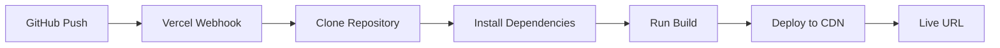
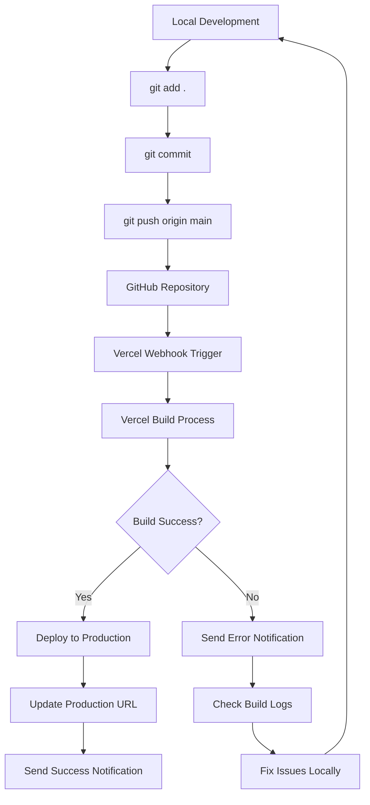

# 🚀 План Деплоя ArtLine Virtual Pitwall

> **Статус**: Готов к выполнению  
> **Дата**: 28 декабря 2024  
> **Цель**: Развернуть проект на Vercel с нуля

---

## 📋 Текущая Ситуация

- ✅ Все изменения внедрены и протестированы локально
- ✅ Проект работает идеально на `localhost:3000`
- ❌ Проект НЕ подключен к GitHub
- ❌ Vercel интеграция отсутствует
- 🎯 Нужно настроить полный CI/CD pipeline с нуля

---

## 🎯 Этапы Деплоя

### **Этап 1: Предварительные Проверки** ⚡

#### 1.1 Локальная Сборка
```bash
npm run build
```
**Ожидаемый результат:**
- ✅ Все страницы компилируются без ошибок
- ✅ Показывается список всех маршрутов
- ✅ Build завершается успешно

**Критические страницы для проверки:**
- `/` - Главная страница
- `/features` - Функции системы
- `/demos` - Список демонстраций
- `/demos/team` - Team Demo
- `/demos/artline` - ArtLine Demo
- `/demos/fleet` - Fleet Control
- `/demos/tracks` - Tracks Demo
- `/partners/artline` - ArtLine Partner
- `/partners/torgmash` - Torgmash Partner
- `/partners/torgmash/analysis` - Torgmash Analysis

#### 1.2 TypeScript Проверка
```bash
npx tsc --noEmit
```
**Ожидаемый результат:**
- ✅ Нет ошибок типизации
- ⚠️ Если есть ошибки - исправить перед деплоем

#### 1.3 ESLint Проверка
```bash
npx next lint
```
**Ожидаемый результат:**
- ✅ Нет критических ошибок
- ⚠️ Warnings допустимы, но лучше исправить

#### 1.4 Создание Бэкапа
```bash
node scripts/backup/backup-content.js
```
**Ожидаемый результат:**
- ✅ Создан snapshot текущего состояния
- ✅ Бэкап сохранен в `scripts/backup/`

---

### **Этап 2: Настройка Git** 🔧

#### 2.1 Проверка Git Инициализации
```bash
git status
```

**Если репозиторий не инициализирован:**
```bash
git init
```

#### 2.2 Проверка .gitignore

Убедиться что файл [`.gitignore`](../.gitignore) содержит:
```gitignore
# dependencies
/node_modules
/.pnp
.pnp.js

# testing
/coverage

# next.js
/.next/
/out/

# production
/build

# misc
.DS_Store
*.pem

# debug
npm-debug.log*
yarn-debug.log*
yarn-error.log*

# local env files
.env*.local
.env

# vercel
.vercel

# typescript
*.tsbuildinfo
next-env.d.ts

# backups
/backups
scripts/backup/*.json
scripts/backup/*.md
```

#### 2.3 Добавление Файлов в Git
```bash
git add .
```

#### 2.4 Первый Коммит
```bash
git commit -m "feat: initial commit - ArtLine Virtual Pitwall with complete UX overhaul"
```

**Описание изменений в коммите:**
- ✅ Новая навигация с breadcrumbs
- ✅ Реструктуризация demos
- ✅ Партнерские страницы
- ✅ Улучшенный UX/UI
- ✅ Мобильная адаптация

---

### **Этап 3: Создание GitHub Репозитория** 🐙

#### 3.1 Создание Репозитория на GitHub

**Вариант A: Через GitHub Web Interface**
1. Перейти на https://github.com/new
2. Название: `artline-virtual-pitwall`
3. Описание: `ArtLine Virtual Pitwall - Professional Racing Telemetry System`
4. Visibility: `Public` или `Private` (на выбор)
5. ❌ НЕ добавлять README, .gitignore, license (уже есть локально)
6. Нажать "Create repository"

**Вариант B: Через GitHub CLI** (если установлен)
```bash
gh repo create artline-virtual-pitwall --public --source=. --remote=origin
```

#### 3.2 Подключение Remote Repository
```bash
git remote add origin https://github.com/YOUR_USERNAME/artline-virtual-pitwall.git
```

**Замените `YOUR_USERNAME` на ваш GitHub username!**

#### 3.3 Проверка Remote
```bash
git remote -v
```

**Ожидаемый результат:**
```
origin  https://github.com/YOUR_USERNAME/artline-virtual-pitwall.git (fetch)
origin  https://github.com/YOUR_USERNAME/artline-virtual-pitwall.git (push)
```

#### 3.4 Push в GitHub
```bash
git branch -M main
git push -u origin main
```

**Ожидаемый результат:**
- ✅ Все файлы загружены на GitHub
- ✅ Репозиторий доступен по URL

---

### **Этап 4: Настройка Vercel** ☁️

#### 4.1 Создание Аккаунта Vercel (если нет)
1. Перейти на https://vercel.com/signup
2. Выбрать "Continue with GitHub"
3. Авторизовать Vercel для доступа к GitHub

#### 4.2 Импорт Проекта в Vercel

**Через Vercel Dashboard:**
1. Нажать "Add New..." → "Project"
2. Выбрать "Import Git Repository"
3. Найти `artline-virtual-pitwall` в списке
4. Нажать "Import"

#### 4.3 Настройка Проекта

**Framework Preset:**
- ✅ Автоматически определится как `Next.js`

**Build Settings:**
- Build Command: `npm run build` (по умолчанию)
- Output Directory: `.next` (по умолчанию)
- Install Command: `npm install` (по умолчанию)

**Root Directory:**
- ✅ Оставить пустым (корень проекта)

**Environment Variables:**
- ❌ Пока не нужны (нет API ключей)

#### 4.4 Запуск Деплоя
1. Нажать "Deploy"
2. Дождаться завершения сборки (2-5 минут)

**Процесс деплоя:**


---

### **Этап 5: Проверка Деплоя** ✅

#### 5.1 Проверка Build Logs

**В Vercel Dashboard:**
- Открыть вкладку "Deployments"
- Кликнуть на последний деплой
- Проверить логи на ошибки

**Успешный деплой показывает:**
```
✓ Compiled successfully
✓ Linting and checking validity of types
✓ Collecting page data
✓ Generating static pages (10/10)
✓ Finalizing page optimization
```

#### 5.2 Получение Production URL

**Vercel автоматически создаст URL:**
- Production: `https://artline-virtual-pitwall.vercel.app`
- Preview: `https://artline-virtual-pitwall-git-main-username.vercel.app`

#### 5.3 Тестирование Production Сайта

**Критические проверки:**

1. **Главная страница** (`/`)
   - ✅ Загружается без ошибок
   - ✅ Навигация работает
   - ✅ Breadcrumbs отображаются

2. **Features** (`/features`)
   - ✅ Карточки функций отображаются
   - ✅ Анимации работают

3. **Demos** (`/demos`)
   - ✅ Список демонстраций загружается
   - ✅ Карточки кликабельны

4. **Team Demo** (`/demos/team`)
   - ✅ Страница загружается
   - ✅ Breadcrumbs показывают путь

5. **ArtLine Partner** (`/partners/artline`)
   - ✅ Страница загружается
   - ✅ Контент отображается

6. **Мобильная версия**
   - ✅ Навигация адаптивна
   - ✅ Меню открывается/закрывается
   - ✅ Контент читаем на малых экранах

7. **Производительность**
   - ✅ Lighthouse Score > 90
   - ✅ First Contentful Paint < 2s
   - ✅ Time to Interactive < 3s

---

### **Этап 6: Настройка Автоматического Деплоя** 🔄

#### 6.1 Проверка Git Integration

**В Vercel Dashboard:**
- Settings → Git
- Убедиться что включено:
  - ✅ "Production Branch": `main`
  - ✅ "Auto Deploy": Enabled
  - ✅ "Deploy Previews": Enabled

#### 6.2 Тест Автоматического Деплоя

**Сделать тестовое изменение:**
```bash
# Изменить что-то незначительное, например README
echo "\n## Deployed on Vercel ✅" >> README.md

# Коммит и push
git add README.md
git commit -m "docs: add deployment status"
git push origin main
```

**Ожидаемый результат:**
- ✅ Vercel автоматически запускает новый деплой
- ✅ Через 2-3 минуты изменения видны на production URL
- ✅ Получено уведомление о успешном деплое

---

## 🎨 Диаграмма CI/CD Pipeline



---

## 🔧 Конфигурационные Файлы

### [`vercel.json`](../vercel.json)
```json
{
  "name": "virtual-pitwall",
  "functions": {
    "src/app/**/*.tsx": {
      "maxDuration": 10
    }
  }
}
```

### [`next.config.ts`](../next.config.ts)
- ✅ TypeScript errors игнорируются (временно)
- ✅ Webpack исключает backups
- ✅ Настроены redirects для старых URL

### [`.gitignore`](../.gitignore)
- ✅ Исключены node_modules
- ✅ Исключены .next и build
- ✅ Исключены backups
- ✅ Исключены .env файлы

---

## 🚨 Возможные Проблемы и Решения

### Проблема 1: Build Failed - TypeScript Errors

**Симптомы:**
```
Error: Type error: ...
```

**Решение:**
```bash
# Проверить локально
npx tsc --noEmit

# Если ошибки критичны - исправить
# Если нет - временно отключить в next.config.ts
typescript: {
  ignoreBuildErrors: true
}
```

### Проблема 2: Build Failed - ESLint Errors

**Симптомы:**
```
Error: ESLint found errors
```

**Решение:**
```bash
# Проверить локально
npx next lint

# Исправить критичные ошибки
# Или отключить в next.config.ts
eslint: {
  ignoreDuringBuilds: true
}
```

### Проблема 3: Git Push Failed - Authentication

**Симптомы:**
```
remote: Permission denied
```

**Решение:**
```bash
# Использовать Personal Access Token
# GitHub Settings → Developer settings → Personal access tokens
# Создать token с repo permissions
# Использовать вместо пароля при push
```

### Проблема 4: Vercel Build Timeout

**Симптомы:**
```
Error: Build exceeded maximum duration
```

**Решение:**
- Проверить что нет бесконечных циклов в build
- Оптимизировать импорты
- Убрать тяжелые зависимости из build time

### Проблема 5: 404 на Production

**Симптомы:**
- Локально работает
- На production 404

**Решение:**
- Проверить что все файлы закоммичены
- Проверить case-sensitivity в именах файлов
- Проверить что нет dynamic imports без fallback

---

## 📊 Чеклист Перед Деплоем

### Код
- [ ] `npm run build` проходит успешно
- [ ] `npx tsc --noEmit` без критичных ошибок
- [ ] `npx next lint` без критичных ошибок
- [ ] Все страницы открываются локально
- [ ] Мобильная версия работает

### Git
- [ ] `.gitignore` настроен правильно
- [ ] Все изменения закоммичены
- [ ] Коммит сообщение осмысленное
- [ ] Remote repository настроен

### Vercel
- [ ] Аккаунт создан
- [ ] GitHub интеграция подключена
- [ ] Проект импортирован
- [ ] Build settings корректны

### Тестирование
- [ ] Production URL доступен
- [ ] Все страницы загружаются
- [ ] Навигация работает
- [ ] Breadcrumbs отображаются
- [ ] Мобильная версия адаптивна

---

## 🎯 Следующие Шаги После Деплоя

### 1. Настройка Custom Domain (опционально)
```
Vercel Dashboard → Settings → Domains
Добавить: pitwall.artline.ru
```

### 2. Настройка Analytics
```
Vercel Dashboard → Analytics
Включить Web Analytics
```

### 3. Настройка Environment Variables (когда понадобятся)
```
Vercel Dashboard → Settings → Environment Variables
Добавить API ключи, database URLs и т.д.
```

### 4. Настройка Preview Deployments
```
Vercel Dashboard → Settings → Git
Включить preview deployments для pull requests
```

### 5. Мониторинг
- Настроить уведомления о деплоях
- Подключить error tracking (Sentry)
- Настроить uptime monitoring

---

## 📚 Полезные Ссылки

- [Vercel Documentation](https://vercel.com/docs)
- [Next.js Deployment](https://nextjs.org/docs/deployment)
- [GitHub Actions для CI/CD](https://docs.github.com/en/actions)
- [Vercel CLI Reference](https://vercel.com/docs/cli)

---

## 📝 Заметки

### Важные Команды

**Локальная разработка:**
```bash
npm run dev          # Запуск dev сервера
npm run build        # Проверка сборки
npm run start        # Запуск production сборки локально
```

**Git workflow:**
```bash
git status           # Проверка изменений
git add .            # Добавить все изменения
git commit -m "..."  # Коммит с сообщением
git push origin main # Push в GitHub (автоматический деплой)
```

**Vercel CLI (опционально):**
```bash
npx vercel           # Preview deployment
npx vercel --prod    # Production deployment (не рекомендуется)
npx vercel logs      # Просмотр логов
```

### Workflow После Настройки

1. Разработка локально
2. Тестирование: `npm run build`
3. Коммит: `git commit -m "..."`
4. Push: `git push origin main`
5. ✅ Vercel автоматически деплоит
6. Проверка на production URL

---

**Статус**: ✅ План готов к выполнению  
**Следующий шаг**: Начать с Этапа 1 - Предварительные Проверки  
**Режим**: Переключиться в Code mode для выполнения команд
