# 🎨 Визуальное Руководство по Деплою

> **Наглядные схемы и диаграммы процесса деплоя**

---

## 🗺️ Общая Карта Процесса

```mermaid
graph TB
    Start[Начало] --> Check[Проверки]
    Check --> Git[Настройка Git]
    Git --> GitHub[GitHub Репозиторий]
    GitHub --> Vercel[Vercel Деплой]
    Vercel --> Test[Тестирование]
    Test --> Done[Готово]
    
    style Start fill:#4CAF50
    style Done fill:#4CAF50
    style Check fill:#2196F3
    style Git fill:#FF9800
    style GitHub fill:#9C27B0
    style Vercel fill:#000000
    style Test fill:#F44336
```

---

## 📊 Детальный Процесс Деплоя

```mermaid
graph LR
    subgraph "Этап 1: Проверки"
        A1[npm run build] --> A2[TypeScript Check]
        A2 --> A3[ESLint Check]
        A3 --> A4[Backup]
    end
    
    subgraph "Этап 2: Git"
        B1[git init] --> B2[git add]
        B2 --> B3[git commit]
    end
    
    subgraph "Этап 3: GitHub"
        C1[Create Repo] --> C2[Add Remote]
        C2 --> C3[git push]
    end
    
    subgraph "Этап 4: Vercel"
        D1[Import Project] --> D2[Configure]
        D2 --> D3[Deploy]
    end
    
    subgraph "Этап 5: Проверка"
        E1[Check URL] --> E2[Test Pages]
        E2 --> E3[Verify Mobile]
    end
    
    A4 --> B1
    B3 --> C1
    C3 --> D1
    D3 --> E1
```

---

## 🔄 CI/CD Pipeline

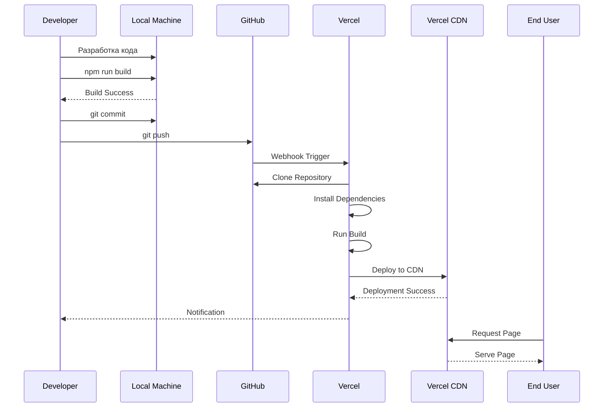

---

## 🏗️ Архитектура Деплоя

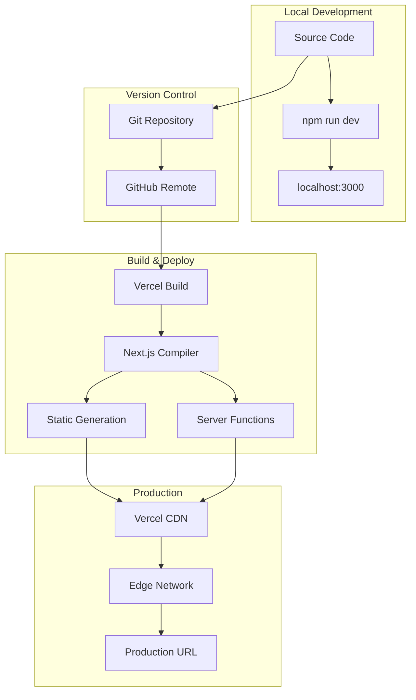

---

## 🌐 Структура URL

```mermaid
graph LR
    Root[artline-virtual-pitwall.vercel.app] --> Home[/]
    Root --> Features[/features]
    Root --> Demos[/demos]
    
    Demos --> DemosList[/demos - список]
    Demos --> Team[/demos/team]
    Demos --> ArtLine[/demos/artline]
    Demos --> Fleet[/demos/fleet]
    Demos --> Tracks[/demos/tracks]
    
    Root --> Partners[/partners]
    Partners --> PArtLine[/partners/artline]
    Partners --> Torgmash[/partners/torgmash]
    Torgmash --> Analysis[/partners/torgmash/analysis]
```

---

## 🔐 Git Workflow

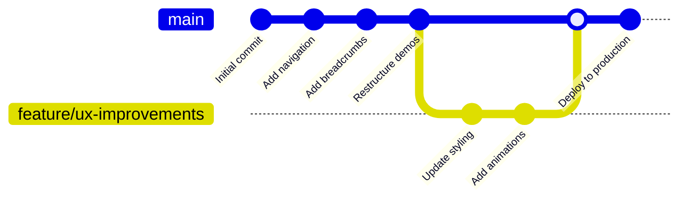

---

## ⚡ Автоматический Деплой

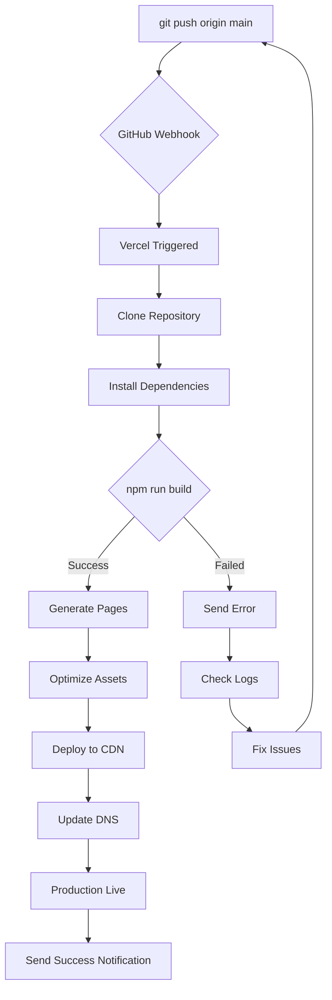

---

## 📱 Responsive Testing Flow

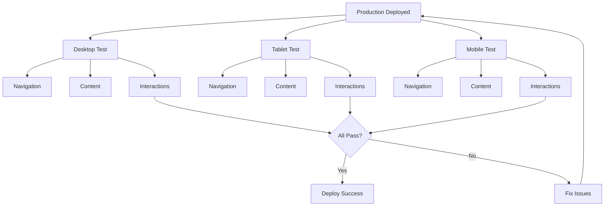

---

## 🎯 Проверка После Деплоя

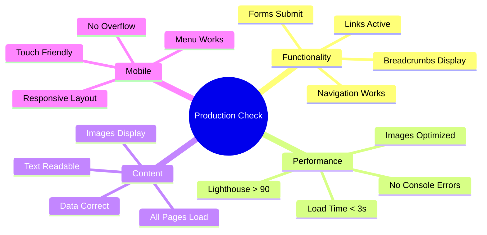

---

## 🚨 Troubleshooting Flow

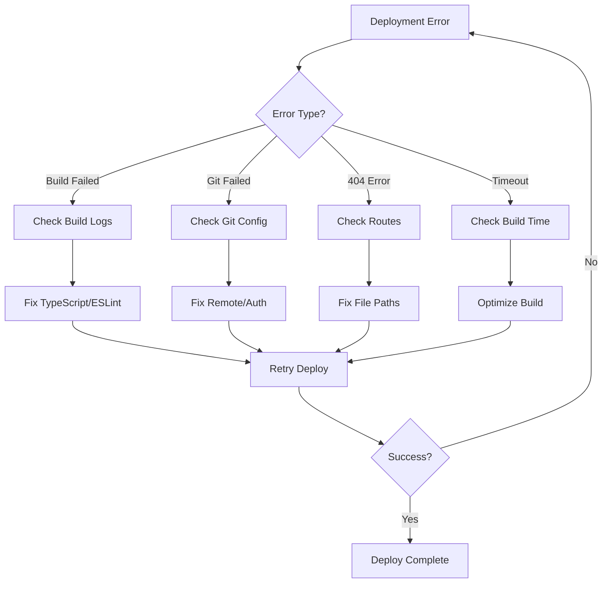

---

## 📈 Deployment Timeline

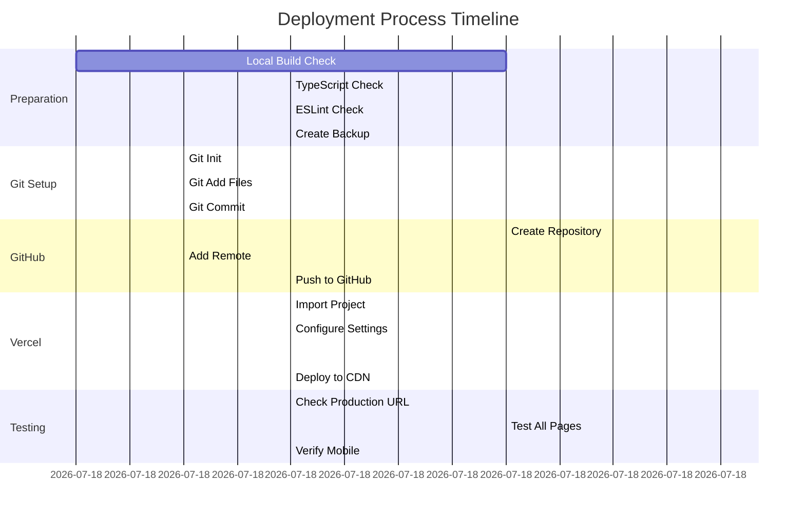

---

## 🎨 Vercel Dashboard Navigation

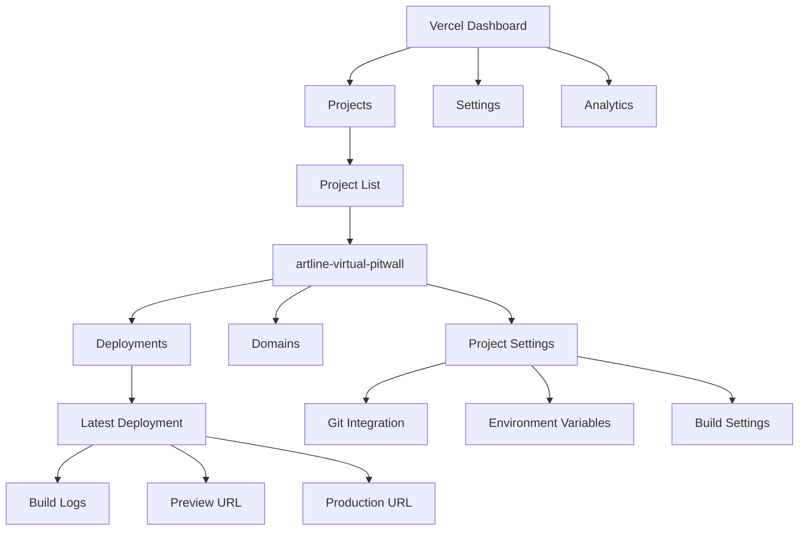

---

## 🔄 Continuous Deployment Cycle

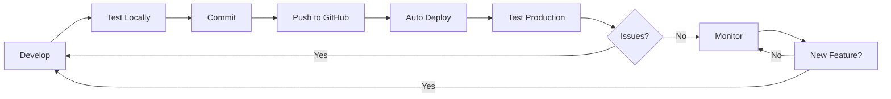

---

## 📊 Deployment Success Metrics

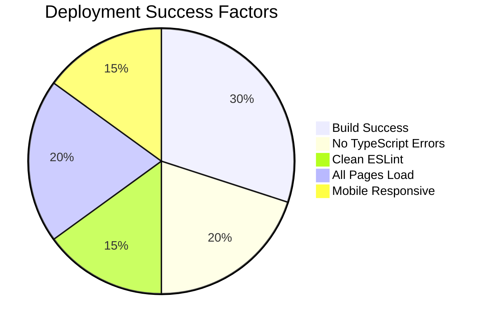

---

## 🎯 Ключевые Точки Проверки

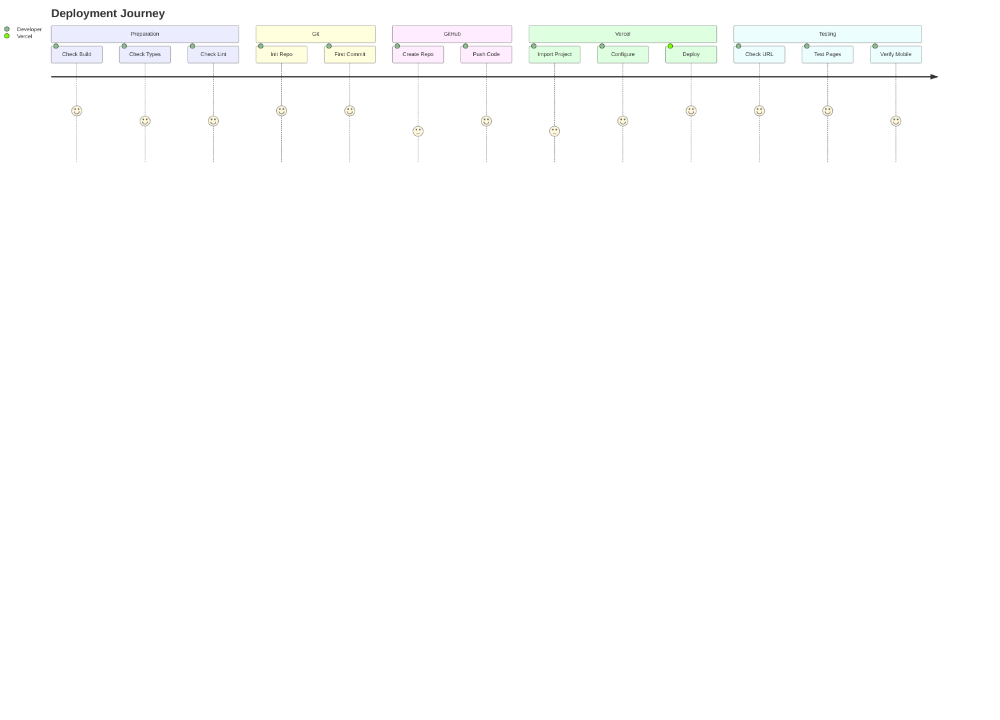

---

**Используйте эти диаграммы для:**
- 📖 Понимания общего процесса
- 🎯 Определения текущего этапа
- 🔍 Диагностики проблем
- ✅ Проверки прогресса

**Следующий шаг**: Переключиться в Code mode для выполнения деплоя
